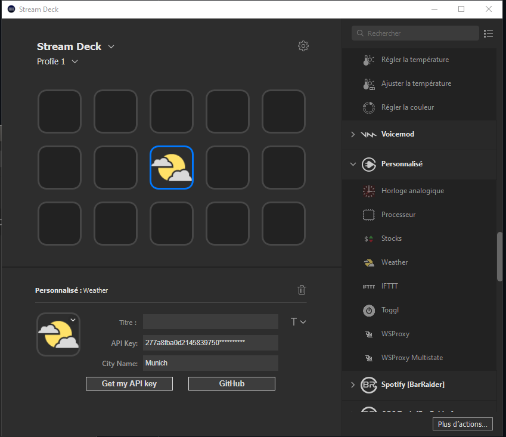

# Description

`Weather` is a plugin that displays a weather condition and temperature. It is connected to weatherApi provider and requires an API Key and a city as required inputs. It has also selection for frequency of fetching and temperature unit.

# Features

- code written in Javascript
- cross-platform (macOS, Windows)
- Property Inspector with multiple UI elements

# Installation

In the Release folder, you can find the file `com.jk.weather.streamDeckPlugin`. If you double-click this file on your machine, Stream Deck will install the plugin.

# Source code

The `Sources` folder contains the source code of the plugin.
